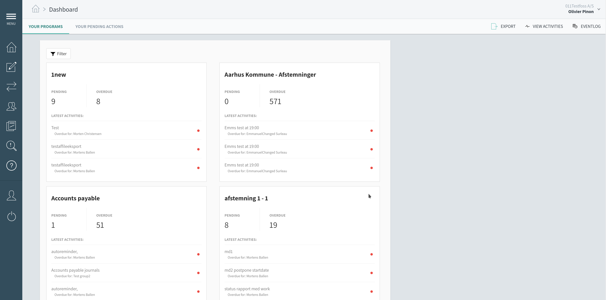

Le ticket est marqué "FIXME" puisqu'il n'est pas écrit. On voit les tags, et les relations de ce ticket avec d'autres (en l'occurence, il est bloquant pour le travail sur d'autres tickets). 

Le ticket possède les parties évoquées dans le rapport : 

* Contexte
* Specifications
* Tests / Critères d'acceptance 

ClubHouse permet de grouper des tickets dans des Epics, qui représentent des parties du modules sur lesquels nous travaillons.

La carte des Risques permet de lister et d'avoir un rendu graphique des risques auxquels l'entreprise doit faire face. 

Ce contrôle permet à l'entreprise de garder trace des jours de congés et des remboursements kilométriques.

La nouvelle page de profil permet à un utilisateur de modifier ses informations (nom, prénom, mail) et paramètres. Elle a été majoritairement développée par moi-même durant mon stage chez Impero cet été.
 

La page d'accueil donne les dernières informations sur les contrôles non remplis par les groups d'utilisateurs.
