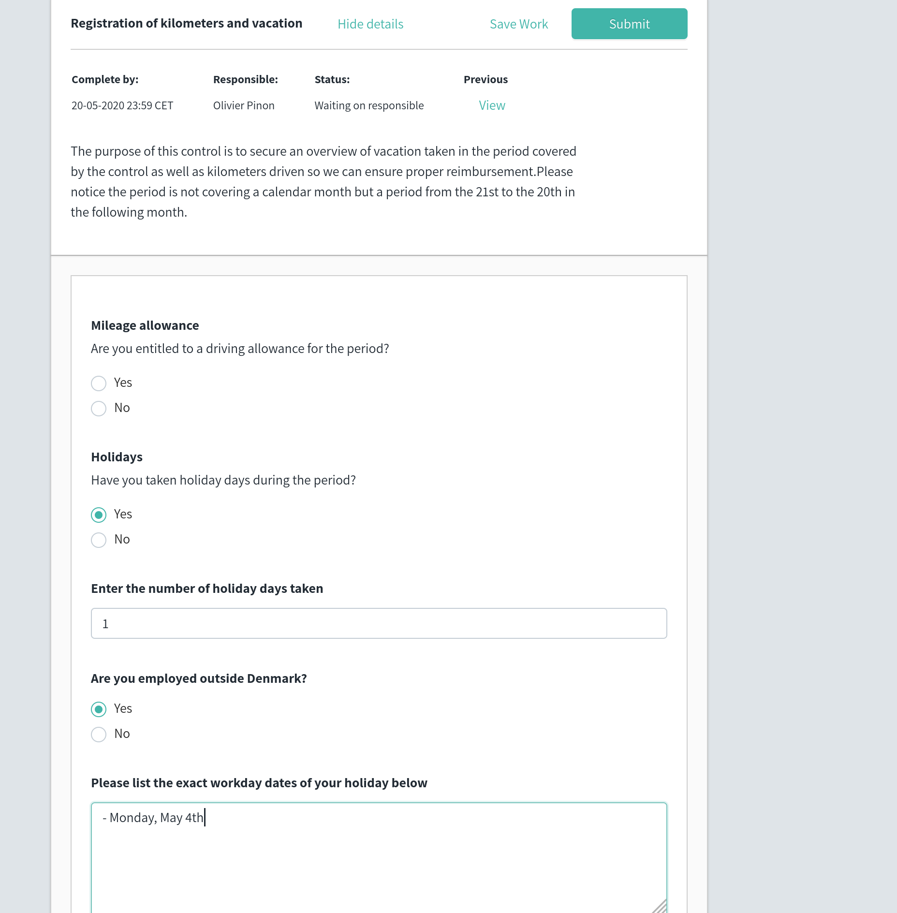

\newpage 

**Remerciements**: 

J'adresse mes premiers remerciements à Monsieur Grégory Obanos, maître d'apprentissage durant la majorité de ma formation, pour le soutien dont il a fait preuve à mon égard. Son expérience et sa sympathie ont fait de ces 3 années l'expérience enrichissante qu'elle a été. 

\

Je souhaite remercier Messieurs Emmanuel Surleau et Arnaud de Bossoreille pour leur suivi sur l'année, les conseils qu'ils m'ont prodigué, la confiance qu'ils m'ont accordé sur le projet de recherche et la relecture du présent rapport.

\

Finalement, je remercie l'ensemble de mes collègues chez Impero avec qui j'ai beaucoup de plaisir à travailler chaque semaine et à retrouver à l'étranger par périodes plus ou moins régulières. Cette équipe sympathique, dynamique et experimentée m'apporte beaucoup sur le plan professionel et m'a permis durant cette troisième année de m'épanouir et de progresser dans une variété de secteurs.

\newpage

# Contexte en entreprise 

## Société Impero 

**Impero A/S** est une société **Danoise** basée à **Aarhus**, dont l'activité réside dans le développement d'une solution logicielle de type **Software As A Service** (SAAS) permettant à ses clients d'assurer le suivi interne en ce qui concerne la **conformité** (compliance en anglais), c'est à dire leurs **obligations légales**. Par sa flexibilité, l'outil permet notamment de suivre :

* La déclarations des taxes,
* La **gestion des risques** liés à l'activité de l'entreprise, 
* L'application de **processus internes** à l'entreprise, notamment : 
	* Le processus de production 
	* Le contrôle de qualité
	* La logistique
* La gestion des **ressources humaines**, notamment :
	* Les congés
	* Le processus de recrutement
* L'application correcte de la **RGPD[^rgpd]** 

L'entreprise a été créée en 2014. Elle développe un seul produit, qui lui rapporte sur l'année 2019 un chiffre d'affaires (CA) de plus de 7.500.000 DKK (soit 1.000.000 EUR). Elle est en forte croissance, en dépit des circonstances économiques[^covid], Impero affiche un CA provisoire de 8.600.000 DKK (1.460.0000 EUR) mi-Q2 2020, soit une augmentation de plus de 100% sur moins de la moitié du temps de l'exercice précédent.

{width="175px"}

[^covid]: Ce document est écrit en Mai 2020 dans le contexte de la crise sanitaire liée à la COVID-19

Les clients de l'entreprise sont en général de **grandes** (voire **très grandes**) entreprises, telles **Maersk (+100.000 salariés)** ou **Bestseller**, qui mettent en place des processus complexes et bénéficient donc du logiciel de manière acrue. Depuis plus d'un an, l'entreprise a revu son fonctionnement pour acquérir de nouveaux clients, et opté pour un partenariat avec une grosse entreprise de conseil / audit: **KPMG**.

Ce partenariat vise à pousser l'entreprise à répondre aux attentes de grands groupes qui choisissent KPMG comme consultant, permettant à Impero d'être **utilisé et éprouvé par des clients sérieux** - qui de plus sont en général très satisfaits de la solution proposée - et ainsi d'avoir une **bonne image**, et des clients qui lui rapportent un chiffre d'affaires relativement important, rapporté à la taille de l'entreprise.

[^rgpd]: Règlement Général sur la Protection des Données, règlement visant à renforcer et unifier la protection des données pour les individus au sein de l'UE 

## Logiciel Impero

Le logiciel se présente sous la forme d'une application web. Le principe de la solution est d'être très générique dans sa réponse aux besoins, de sorte que le client puisse utiliser le produit comme il l'entend pour correspondre aux contraintes propres à son entreprise.    

> Note: afin de ne pas surcharger le document avec trop de captures d'écran, seules 2 sont présentées ici. Il s'agit de parties de l'application qui ont été développées durant l'alternance. D'autres écrans du logiciel sont disponibles dans les annexes de ce rapport.

Afin de comprendre l'intérêt du logiciel, il faut d'abord voir comment il résout le problème de gestion des risques dans une entreprise. 

{width="95%"}

Ceci est la **carte de risques**, ou "Risk Map". Elle permet de lister certains risques auxquels l'entreprise cliente fait face. Par exemple, si l'entreprise X produit des bateaux, elle pourrait avoir un fournisseur qui n'a pas pu honorer sa commande, ce qui implique un risque de retard de production et/ou de livraison pour l'entreprise X. Il faut donc mettre en place des actions pour en minimiser l'impact économique. Comme on peut le voir, un risque est placé sur la carte en fonction de deux caractéristiques :

* Son **impact** (s'il s'avère que l'évènement a réellement eu lieu, *e.g.* le fournisseur n'a pas livré sa commande, quelle en est la gravité pour l'entreprise sur une échelle de 1 à 5), et
* Sa **probabilité** (combien de chances cet événement a-t-il d'arriver, sur une échelle de 1 à 5).

Il va de soi que plus un **risque inhérent** à l'entreprise a un fort impact et une forte probabilité d'arriver, plus ce risque est critique pour celle-ci. Il convient alors de mettre en place un processus face à celui-ci pour en limiter les effets négatifs. On parle alors d'**atténuation de risque**, et le risque une fois atténué laisse place à un "risque résiduel", qu'on peut observer en cliquant sur le bouton de sélection en haut à droite. Lorsque l'on cherche à appliquer un processus en face d'un risque, c'est là qu'interviennent les **contrôles** et les **programmes de contrôle**.

Un **contrôle** est une partie d'un processus que l'on met en œuvre. L'outil Impero permet à l'utilisateur de personnaliser ceux-ci, dans le but de coller au mieux à son processus interne. Concrètement, un contrôle est un **formulaire personnalisé** envoyé à un utilisateur. Il peut contenir :

* Des champs de textes, qu'ils soient numériques ou non
* Des réponses par bouton radio (une seule réponse possible parmis n choix)
* Des réponses par checkbox (plusieurs réponses possible parmis n choix)
* Un choix via un dropdown (une seule réponse possible parmis n choix)
* Des fichiers associés (PDF comme un bon de livraison, Image comme une photo témoignant du bon déroulé de l'opération)

Chaque utilisateur de l'application (et donc membre de l'entreprise cliente d'Impero) peut être assigné au remplissage d'un contrôle, générant alors un **résultat de contrôle**, ou "control result". Celui-ci sera stocké sur les serveurs d'Impero, et pourra être relu *a posteriori* par un utilisateur ayant les droits adéquats, afin qu'il puisse attester à tout moment de la réalisation correcte de toutes les étapes du processus. Optionellement, on peut paramétrer des **contrôles récurrents**. Par exemple, on peut assigner tous les employés au remplissage du contrôle "Saisie des congés et heures supplémentaires" tous les 20 du mois, ce qui permet d'éviter un suivi individuel autrement plus fastidieux. On pourra également appliquer des rappels sur ces contrôles (X heures ou Y jours avant une date, par exemple). 

La figure suivante montre le contrôle que l'entreprise Impero utilise pour le suivi des congés de ses employés. Chaque personne notera ses jours pris pendant la période précédente, et ses déplacements si applicable. La confiance est de mise : aucun contrôle individuel des horaires n'est mis en place chez Impero. Chacun sait quel objectif est à remplir dans la semaine, et il appartient à la personne d'arranger ses horaires de manière adéquate - sans toutefois s'exposer à trop de pression.  

{width="90%"}

L'outil est en **développement continu** depuis 5 ans, et il est actuellement en cours de restructuration au niveau de son interface et de son ergonomie. Il faut également noter une **ré-écriture côté serveur** afin d'effacer la dette technique induite par la couche logicielle existante (dite **"Legacy"**) que nous évoquerons plus loin.

Le but actuel de l'entreprise est de prendre en compte les remarques des clients et d'engager la ré-écriture des modules existants sur une nouvelle technologie, afin de repartir sur des bases saines pour l'évolution du logiciel tout en satisfaisant les clients. 

## Organisation interne 

L'entreprise est composée de 14 collaborateurs dont 6 ont des compétences techniques permettant le développement du produit. 

```{.svgbob name="Organigramme de la société Impero"}

                  +-------------------+
                  | Rikke Stampe Skov | Présidente Directrice Générale
                  +-------------------+

       +--    Pôle commercial   --+            |  Pôle relation clients | Directeur artistique
       |                          |            |                        |
+------+----------+ +-------------+----------+ | +--------------+       |  +----------------+
| Karsten Mayland | | Jacob Engedal Sørensen | | | Morten Balle |       |  | Thomas Norsted |
+-----------------+ +------------------------+ | +--------------+       |  +----------------+
 Directeur commercial                          |  Product Owner         |
                                               |                        |-----------------------------
                                               | +---------------+      | Responsable de communication
                                               | | Thomas Aagard |      | +-----------------+
                                               | +---------------+      | | Lise Kildsgaard |
                                               |                        | +-----------------+
                                               | +--------------------+ |
                                               | | Morten Christensen | |
                                               | +--------------------+ |


                           Pôle DevOps : Développement + Infrastructures
 +-------------------------------------------------------------------------------------------------+
 |                                                                                                 | 
 | +------------------+                                 +-----------------------+                  | 
 | | Emmanuel Surleau | Directeur technique             | Arnaud de Bossoreille | Lead Développeur | 
 | +------------------+                                 +-----------------------+                  | 
 |                                                                                                 | 
 | +-----------------+  +-------------+ +--------------+ +---------------+                         | 
 | | Grégory Obanos  |  | Oliver Hoog | | Mateus Costa | | Olivier Pinon |                         | 
 | +-----------------+  +-------------+ +--------------+ +---------------+                         | 
 |                                                                                                 | 
 +-------------------------------------------------------------------------------------------------+


```

Le travail à distance (pas seulement en contexte de pandémie mondiale !) a été intégré dans la culture de l'entreprise depuis quelques années. Chaque employé est autorisé au télétravail, ce qui permet à celle-ci de ne pas s'encombrer de recrutements conditionnés par la situation géographique des candidats. Le recrutement est donc parfaitement équitable puisqu'il s'effectue donc sur les **compétences** du candidat, et non sur d'autres critères arbitraires. 

L'équipe de développement est intégralement décentralisée (mais travaille sur le même fuseau horaire tout de même), avec trois ingénieurs en France, un en Allemagne, un en Hongrie, et le CTO[^cto] au siège de l'entreprise, à Aarhus. 

Cette méthode de travail dite "**remote**" (comprendre : à distance) était nouvelle pour moi, mais j'y ai pris goût pour la liberté d'action qu'elle offre, bien qu'elle implique d'avoir une organisation correcte de son temps afin de ne pas mixer vie professionelle et personnelle.

[^cto]: Chief Technical Officer, Directeur Technique.


## Environnement technique

L'entreprise Impero déploie sa solution Web sur un serveur à l'aide d'**Ansible**, un outil open-source permettant la mise en production déclenchée sur ordre du CTO ou du lead développeur après l'application de la procédure de test et validation, et l'avis conforme du product owner.

L'architecture du logiciel est composée d'un serveur, que nous appelerons **"backend"** et qui héberge une application Web, que nous appelerons **"frontend"**. 

Le backend est implémenté avec le langage de programmation **Rust**, qui vise à permettre à tout développeur de fournir des programmes sûrs et performants, tirant avantage des technologies modernes (comme le **multithreading**) tout en leur offrant beaucoup d'outils pour leur faciliter la tâche. Rust est un langage dit "système" capable de cibler toutes les plateformes allant d'**Android** au **Web** (via **WebAssembly**) en passant par les OS plus conventionnels, jusqu'à l'**informatique embarquée**. Celui-ci est **multi-paradigme** (on peut s'en servir comme d'un langage fonctionnel, impératif, voire même orienté objet sur certains aspects). Son **compilateur strict** élimine une bonne partie des erreurs avant qu'elles n'arrivent en production grâce au **typage fort** et à la **vérification des accès**, et facilite la définition de structures de données propres grâce à son système d'**ownership** qui empêche d'avoir des références mutables sur un même élément à plusieurs endroits dans le code. Pour en savoir plus, consulter "The Rust Programming Language" [@rustbook].

On mentionnera également que beaucoup de gros noms de l'industrie (Google et Facebook notamment) ont de forts intérêts dans le langage car il permet de faciliter le travail autour des problèmes de sécurité. Microsoft a notamment engagé un travail dérivé de celui-ci pour apporter plus de souplesse sans sacrifier les garanties apportées.

{width="150px"}

Dans le cadre du logiciel Impero, le serveur Web est implémenté à l'aide de Rocket, un framework web très complet dont nous détaillerons le fonctionnement plus tard. 

Le frontend est implémenté avec **TypeScript**, une couche de sûreté sur JavaScript apportant plus de garanties statiques[^staticguarantees] permettant également de faire moins d'erreur et de rendre le refactoring plus aisé. Le framework **React** est utilisé pour faciliter la développement d'une interface utilisateur techniquement très complexe et fonctionnellement intuitive, tout en la rendant maintenable. Enfin, le framework d'interface **Ant Design** sert de cadre à l'application pour lui donner une touche moderne et un peu d'esthétisme.

{width="150px"}

L'entreprise laisse carte blanche à ses employés en ce qui concerne leur environnement de travail personnel : un budget est donné à chacun pour acheter un ordinateur détenu pendant la durée de son contrat. Ainsi, le collaborateur est libre de choisir son système d'exploitation, l'IDE[^ide] utilisé, et ainsi d'avoir un poste de travail vraiment personnel. Cette particularité implique cependant de standardiser l'environnement de développement, afin d'éviter les problèmes liés aux différentes plateformes. **Docker**, le système de conteneurs devenu standard de l'industrie, est donc tout indiqué. Ce dernier offre également le bénéfice de pouvoir travailler facilement avec des systèmes à l'installation complexe et sensible aux erreurs comme **Redis** et **PostgreSQL**, sur lesquels le backend s'appuie.

{width="150px"}

Afin de garder une trace des différentes versions du logiciel et de permettre le travail collaboratif, Bitbucket a été mis en place. Impero bénéficie du système d'Intégration Continue (CI) de ce dernier, ce qui est d'ailleurs grandement facilité par l'utilisation de Docker sus-mentionné, dans le but d'empêcher la mise en production d'un système qui n'aurait pas été testé, et de faire travailler d'autres personnes avec un programme qui ne compile pas. 

[^staticguarantees]: Garanties apportées par le compilateur permettant notamment d'être sûr que le programmeur n'a pas fait d'erreur de type.
[^ide]: Integrated Development Environment, logiciel pour écrire du code.

## Problématiques en tant qu'Ingénieur Développement

Dans l'optique de s'agrandir, l'entreprise a augmenté sa capacité de production. Le nombre de développeurs est passé de 3 à 6 sur l'année 2019. Cela implique des tâches de gestion plus complexes, notamment dans la rédaction des spécifications techniques décrites plus tôt. A cet effet, le processus de spécification est en train d'évoluer pour permettre aux DevOps[^devops] d'être impliqué dans la rédaction des tickets. J'ai donc été amené à participer - voire animer par moment - des **refinement meeting**. Nous développerons cela dans la partie **Développement et spécifications de nouvelles fonctionnalités**.

[^devops]: Développeurs Opérationnels, terme générique pour un développeur également en charge des infrastructures réseaux.

Toujours dans sa politique de croissance, Impero a cherché à créer des partenariat avec des entreprises de plus en plus grandes (sans citer d'exemple puisque cette information est confidentielle, le groupe compte plus de 650.000 employés). Avoir des clients d'une telle taille implique d'apporter un soin particulier au développement de l'interfaçage de sa solution avec son client, ces derniers ayant tendance à vouloir recréer des outils internes utilisant les fonctionnalités et les données proposées par les outils externes, dont le logiciel Impero fait partie. Il apparaît donc clairement qu'il faut trouver un moyen pour l'entreprise de :

* Mettre en place un accès exterieur sur son API[^api] publique. 
* Documenter celui-ci 
* Faire en sorte qu'elle respecte au maximum les standards de l'industrie du logiciel, dans le cas présent, une API REST

L'objectif du projet de recherche qui a été mené était de faciliter l'écriture et le maintien de nouveaux services complexes, qui seront directement exposés au client. 

> Note: Le développement du projet de recherche est actuellement (Mai 2020) à l'arrêt puisque toutes les ressources de développement de l'entreprise sont mises à contribution pour l'écriture des fonctionnalités promises aux clients, mais ce projet correspond à une période de travail allant de Septembre 2019 à Mars 2020 qu'il convient de développer dans ce rapport.  

[^api]: Application Programming Interface, ou interface logicielle permettant d'intéragir avec notre système.

# Recherche - Couche d'abstraction pour framework Web

## Contexte et objectif 

Afin de résoudre la problématique d'ouverture de l'API que nous venons d'énoncer, il est important de comprendre le contexte dans lequel le backend est développé, et quels objectifs ce projet de recherche se propose d'atteindre. 

Le travail s'articule autour de l'outil Diesel, déjà utilisé en année deux (cf. Rapport 2, [@rapport2]) que nous qualifierons d'ORM[^orm]. Cette librairie ajoute de la sureté lorsque l'on travaille avec du SQL[^sql], uniquement sur les systèmes de gestion de base de données relationnelles, au prix de l'écriture d'un code un peu plus verbeux. Cette sureté se traduit concrètement de la façon suivante : 

* La requête SQL que l'on écrit est vérifiée **statiquement** (comprendre : à la compilation), et est garantie d'être valide. Il n'y a **aucune** possibilité de faire une faute de frappe, de requêter des champs d'une autre table par mégarde, mais surtout lorsqu'une modification est apportée à la structure de la base de données, si la requête devenait invalide, le compilateur en avertirait aussitôt le programmeur ce qui représente un gain de temps et de sécurité non-négligeable. 
* Les structures de données qu'un programmeur écrit sont également vérifiées pour qu'elle puisse accueillir le résultat d'une requête, sans quoi le compilateur ne générera pas de code exécutable.

{width="150px"}

Comme indiqué précédemment, cet outil a un prix: les structures et les requêtes à écrire sont plutôt verbeuses, et écrire plus de code amène immédiatement des problèmes de maintenabilité. De plus, il faut écrire le code de glue entre le serveur HTTP et l'outil Diesel, afin de mettre des actions en face d'une requête HTTP reçue par le serveur.

Cette glue s'appelle un Service. Il s'agit d'un groupe d'endpoints (notion que nous définirons par la suite), qui permet de définir quelles interactions un client peut avoir avec le serveur. Un Service applique une logique qui est en général souvent la même (ou très similaire), mais qui agit sur des sources de données différentes, et qui peut varier selon ce que la logique métier implique. Par exemple, remplacer la définition en base de données d'un Utilisateur ou d'un Contrôle (pour le cas d'Impero) appliquera une logique très similaire, où la variante est la table que l'on modifie et le contrôle d'accès. En d'autres termes, très peu de code change, et celui-ci est en général fastidieux à écrire et peut ammener des erreurs. 

Le projet de recherche s'appelle **PEWS**. C'est un anagramme récursif pour **PEWS : Easy Web Services**. Son but est de faciliter, voire retirer la nécessité d'écrire cette glue, ce qui permet d'exposer l'interface en écrivant moins de code, donc d'obtenir une meilleure maintenabilité, et de la rapidité de développement sans pour autant sacrifier les performances de Rust ni la sûreté de Diesel. Il faut voir PEWS comme **une surcouche à un framework Web**, qui aura pour tâche d'écrire l'intégration des Services à la place du développeur qui n'aura plus qu'à écrire la logique métier si celle-ci varie du fonctionnement classique du service (par exemple si l'on cherche à valider des données ou à vérifier des accès). PEWS vise en quelque sorte le paradigme de **Convention over configuration** que l'on retrouve dans des frameworks comme **Spring** (Java) et **Rails** (Ruby), pièce manquante de l'écosystème Web en Rust. 

Dans un soucis de pérennité, il est prévu de publier la librairie sous une licence Open-Source (type **MIT**), puisqu'il nous a semblé que PEWS correspondait à un besoin de la communauté Rust de manière générale. Afin de favoriser l'utilisation au sein de ladite communauté, et de rendre l'outil le plus flexible et correct possible, il s'agit de faire en sorte que PEWS puisse faire abstraction du framework Web de l'utilisateur, auquel on ajoute des fonctionnalités. 

Afin de comprendre comment nous pouvons aborder ce problème et les raisons qui ont poussées vers l'architecture de PEWS, il faut d'abord appréhender le fonctionnement d'un framework web.

[^orm]: Object Relational Mapping, couche logicielle permettant de faciliter l'intéraction avec la base de données.
[^sql]: Structured Query Language, langage utilisé pour effectuer des requêtes sur des bases de données relationelles.

## Etat de l'art

### Définition d'un framework web

Un framework web est une brique logicielle permettant d'exposer des fonctionnalités sur un serveur, dans le but de répondre à des requêtes utilisant le protocole de communication client-serveur HTTP (et HTTPS, si le serveur supporte le chiffrement via TLS), standards du Web.

Le framework a pour but d'exposer des routes, que l'on appelle communément des endpoints. Par exemple, le site de CPE contient l'article suivant: `https://www.cpe.fr/actualite/actu-chimie-nouveau-diplome-en-chimie/`. Le endpoint qui pourrait être exposé pour accéder à cet article est le suivant: `GET /actualite/<nom_article>`. Celui-ci permet de répondre à une requête précise. Pour rappel, le protocole HTTP définit une requête de la façon suivante:

```{.svgbob name="Composition d'une Requête HTTP" width="400px"}

+-------+ +-----+ +---------+
| Verbe | | URI | | Version |
+-------+ +-----+ +---------+

+---------------------------+
| Headers (en-tête d'une    |
| requête HTTP)             |
+---------------------------+

+---------------------------+
| Contenu de la requête     |
+---------------------------+

```

Dans l'exemple d'endpoint : 

* `GET` est le Verbe HTTP. Il en existe 9 cf. [@httpmozilla] nous en utilisons communément 5 :  
	* GET - pour récupérer une ressource
	* POST - pour créer une ressource 
	* PUT - pour appliquer une modification totale sur une ressource
	* PATCH - pour appliquer des modifications partielles sur une ressource 
	* DELETE - pour supprimer la ressource 
* `/actualite/` est la base de l'**URI[^uri]**, (ou le chemin), auquel l'utilisateur souhaite avoir accès. 
* `<nom_article>` est une notation qui permet d'indiquer que ce qui est à cet endroit de l'URI est une **variable** que l'on va devoir traîter côté serveur. Ici, `nom_article = actu-chimie-nouveau-diplome-en-chimie`. Cela pourraît être un identifiant qui permettrait de signaler au serveur à quel post du blog nous souhaitons accéder. 

[^uri]: Uniform Resource Identifier, chaîne de caractères représentant l'adresse d'une ressource comme une page web, ou une donnée.

Un framework web expose donc un moyen de déclarer à quelle "route", ou plutôt à quelle requête HTTP comme expliqué ci-dessus, nous pouvons répondre. En face de cette route, le serveur doit mettre une logique associée. Dans le cadre de notre exemple, il pourrait s'agir d'aller chercher le titre du blog et son contenu associé dans une base de données, de formatter le contenu, puis de retourner au client une page web valide à afficher sur son navigateur. 

```{.svgbob name="UML - Diagramme de séquence montrant le fonctionnement d'un endpoint"}

Base de données           framework Web                           Client 
     _                          _                                    _
     |                          |    GET / actualite / actuXXX       |
     |                        +-+<-----------------------------------|
     |                Routing | |                                    |
     |                        +>|                                    |
     | SELECT ... FROM articles |--+-+----------------+              | 
     | WHERE name = 'actuXXX'   |  |/ Logique interne |              | 
     |<-------------------------+  +------------------+              | 
     | Ok(article)              |                                    | 
     |- - - - - - - - - - - - ->|    Ok(page internet)               | 
     |                          |- - - - - - - - - - - - - - - - - ->| 
     |                          |                                    | 
      
```

Dans ce cas, la logique interne peut valider l'accès d'un client via un cookie ou un header HTTP, puis initier une connexion à la base de données, récupérer le contenu de l'article, le formatter et l'afficher. 

Le formattage de la donnée peut varier selon l'architecture du backend, comme dans les cours vus en 4ème année : 

* En Web dynamique, le serveur gèrera le rendu de la page et retournera une page HTML valide,
* En Web statique, la donnée est retournée telle quelle, après l'avoir **sérialisée** dans un format compréhensible par le client. 

En Rust, un framework expose un **Trait** (contrainte similaire à une interface en POO[^poo], pour en savoir plus lire "The Rust Programming Language" [@rustbook]) ou une **Structure** qu'il sait transformer en réponse HTTP à renvoyer au client. De cette façon, l'utilisateur du framework peut retourner ses propres types dont il a défini la conversion en réponse HTTP, ce qui lui donne un contrôle total.  

[^poo]: Programmation Orientée Objet, paradigme de programmation centré sur la définition et l'interaction de briques logicielles appelées objets (Wikipédia). 

Un framework Web va le plus souvent définir un moyen permettant d'accéder à des ressources internes qu'il pourra partager entre plusieurs requêtes. Par exemple:

* Un connecteur à une base de données (comme PostgreSQL), ou à un cache (comme Redis),
* Une variable dont le contenu peut être utilisé par les routes, comme une constante de configuration par exemple, ou le contenu d'un fichier, également de configuration,
* Un accès à un système de journalisation (logs),
* Une brique logicielle permettant de gérer l'identification ou les autorisations d'un utilisateur.

Pour comprendre le travail d'abstraction de PEWS il s'agit ensuite d'étudier au cas par cas les différents framework Web existants dans l'écosystème Rust, dans le but de comprendre comment chacun gère : 

* La déclaration d'une route et le routage,
* La réponse à un client,
* Le partage de ressources en interne,

Et ainsi de savoir comment exposer les fonctionnalités de chacun. Nous étudierons donc le fonctionnement des deux frameworks majeurs, et d'un troisième dont l'implémentation plus proche du paradigme de programmation fonctionnelle est intéressante, particulièrement parce qu'elle a inspiré la solution vers laquelle PEWS s'est tourné.

### Premier cas d'étude : Rocket

Rocket est un framework qu'on peut considérer comme l'un des plus matures de l'écosystème Rust. C'est celui que l'entreprise utilise pour développer le backend de la solution Impero. 

Selon son site internet [@rocketweb] : 

> Rocket est un framework web écrit avec Rust, qui permet d'écrire des applications Web rapides et sécurisées sans sacrifier la flexibilité, la facilité d'utilisation ni la sûreté.

La particularité de Rocket est qu'il utilise la chaîne de compilation Rust **nightly** (comprendre : instable), qui lui permet d'accéder à certaines fonctionnalités des macros procédurales du langage, au prix de l'utilisation d'une chaîne Rust qui peut potentiellement casser d'une semaine à l'autre. Ce n'est pas nécessairement un désavantage, il n'y a pas eu de problème de ce genre pour l'instant, et celui-ci serait de toute façon contournable simplement. Pour palier les problèmes d'instabilité, Impero ne met à jour cette chaîne qu'après une long période de temps et à un moment où le risque est limité (pas de mise en production à court terme).

L'utilisation des macros procédurales permet à l'utilisateur d'être très expressif dans la définition des routes : 

```rust
#[get("/hello/<name>/<age>")]
fn hello(name: String, age: u8) -> String {
    format!("Hello, {} year old named {}!", age, name)
}

fn main() {
    Rocket::ignite()
    .mount("/", routes![hello])
    .launch();
}
```
Note pour la compréhension:

* u8 est un entier non-signé codé sur 8 bits (valeurs dans l'intervalle 0 -> 255).
* `format!()` est une macro mettant les paramètres sous la forme d'une variable de type String (chaîne de caractères).
* Ici, pour un client qui envoie une requête sur `GET /hello/Olivier/22`, on retourne `Hello, 22 year old named Olivier!`.

Comme on peut le constater, on trouve ici la définition du verbe HTTP, de la route (URI), et de la logique interne associée, ici le formattage de la réponse en chaîne de caractères.

Rocket définit un système de "Gardes de requête" pour accéder à des ressources internes. Ceux-ci permettent de tirer avantage de la sûreté apportée par Rust pour écrire des services Web qui seront plus résistants aux erreurs. Dans l'exemple précédent, l'âge est de type `u8`. Si un client envoyait la requête `GET /hello/Olivier/abc`, abc n'étant pas transformable en un nombre compris entre 0 et 255, la requête doit échouer. Rocket effectue cette analyse tout seul, se rend compte que la transformation a échoué, et continue à chercher une autre route qui correspond à ce que l'utilisateur a demandé. Eventuellement, si le serveur ne définit pas de route qui correspond, il retournera le code d'erreur HTTP `404 Not Found`.

Les gardes sont appellés sous la forme d'un type que l'on donne en paramètre d'une fonction, puis grâce à ses macros procédurales, Rocket se charge d'écrire tout seul le code permettant d'appliquer le comportement de ceux-ci. 

Enfin, Rocket possède une grosse communauté qui a développé beaucoup d'outils très pratiques notamment sur la **sérialisation JSON** et la **connexion avec les bases de données**. Pour ses points négatifs, il est important de noter que **Rocket est pour l'instant entièrement synchrone**, nous y reviendrons plus bas. 

### Second cas d'étude : Actix-Web

Actix-web est l'un des deux frameworks les plus populaires de l'écosystème Rust. Pour rappel, c'est la technologie qui a été utilisée dans le cadre du projet 2. Selon son site (cf. [@actixweb]):  

> Actix est le puissant système d'Acteurs de Rust, et le framework web le plus divertissant.

Actix-web dérive en effet à l'origine d'Actix, le système d'acteur évoqué en projet 2. Depuis la version 2.0 du framework, il n'existe cependant plus de dépendance directe entre le framework web et Actix, cette approche ayant été jugée trop inefficace. Depuis, les deux frameworks partagent le nom uniquement puisque l'auteur original l'a souhaité. 

Cette technologie se veut être le point de référence du secteur: actix-web est constamment dans le haut des tests de comparaison de performance (appellés benchmarks) de TechEmpower (cf. [@techempower]). Ces très hautes performances représentent le plus gros avantage du Framework. Celui-ci compile sur la chaîne stable de Rust, garantie importante pour beaucoup de professionnels, et vient avec son lot de fonctionnalités très intéressantes, notamment :

* Une implémentation du protocole WebSocket,
* Support pour HTTP SSE (similaire à WebSocket), 
* Support pour TLS (HTTPS, encryption),
* Support pour HTTP/2,
* Intégration simple avec Actix (utilisation du même exécuteur asynchrone : Tokio).

Ce dernier point est capital même si nous ne rentrerons pas dans le détail du fonctionnement de la programmation asynchrone en Rust. Des documents sont disponibles dans la bibliographie à ce sujet (cf. Asynchronous Programming in Rust [@asyncbook]). Afin d'obtenir des performances toujours meilleures lui permettant de se classer régulièrement premier des tests, Actix-web rend ses réponses asynchrones. Cela veut dire que pendant que le serveur est en attente de quelque chose, comme un fichier qu'il essaie de servir à son client, ou une requête sur la base de données, il peut répondre en parallèle à un autre client, mettant les opérations à la queue dans son exécuteur asynchrone. 

Cette particularité complique la tâche de l'abstraction de PEWS. En effet, on ne peut pas implémenter de surcouche permettant de rendre un framework asynchrone. Il est toutefois possible - c'est la solution qu'utilise PEWS - d'embarquer une opération synchrone dans une opération asynchrone, et donc d'en émuler le fonctionnement. Cependant, il est évident qu'une telle méthode implique nécessairement un sacrifice de performances et la perte de l'intérêt de l'utilisation d'un framework asynchrone. A ce jour, PEWS n'a pas de solutions efficace pour résoudre ce problème vu que la cible principale est Rocket. 

La déclaration d'une route avec Actix-web s'effectue de la manière suivante (code simplifié pour la fonction `main`): 

```rust 
async fn greet(req: HttpRequest) -> impl Responder {
    let name = req.match_info().get("name").unwrap_or("World");
    format!("Hello {}!", &name)
}

fn main() {
    let app = App::new()
        .route("/hello", web::get().to(greet))
        .route("/hello/{name}", web::get().to(greet));
    // .. Utilisation de la structure App pour lancer le serveur
}
``` 

Notes pour la compréhension : 

* La requête `GET /hello` retourne `Hello World!`
* La requête `GET /hello/Olivier` retourne `Hello Olivier!`
* `impl Responder` correspond à n'importe quel type implémentant le trait `Responder`. `String`, retourné par la macro `format!`, implémente ce trait.
* La logique appliquée par le serveur est encore une fois contenue dans une unique fonction: la fonction `greet`. 

On voit ici un système similaire aux Gardes de Rocket: on passe une structure `HttpRequest` à la fonction qui contient la logique de la route, puis on s'en sert pour extraire des informations (*e.g.* le nom de la personne à saluer).

Si on voulait extraire un JSON du corps de la requête HTTP, on ajouterait en paramètre de greet le garde `web::Json<StructureADeserializer>`. Si on voulait accéder à une ressource interne stockée dans le serveur, on ajouterait en paramètre le garde `web::State<RessourceInterneARecuperer>`.

La création de route est manuelle: on monte une route sur une structure `App` en spécifiant le chemin, le verbe HTTP, et la logique à appliquer.

Notons qu'Actix-web version 3.0 propose également une macro procédurale pour générer ses routes comme Rocket le fait. 

Enfin, il est important de noter que le focus sur Actix-web est principalement dû à son énorme popularité dans l'écosystème Rust. Beaucoup d'entreprises et d'individuels refusent de travailler sur celui-ci car le framework s'appuie énormément sur l'utilisation d'`unsafe`[^unsafe], de manière déraisonnée, et parce qu'historiquement il a fait l'objet de controverses au sein de la communauté Rust à cause de problèmes de sécurité potentiels.
 
[^unsafe]: Rust est un langage qui force un programme a être sécurisé et enlève la possibilité de travailler avec des valeurs pouvant causer des comportements indéfinis. `unsafe` permet d'enlever certaines restrictions pour des raisons de performance, mais il faut alors garantir soi-même la sécurité du code. 

### Troisième cas d'étude : Warp

Warp est un framework montant de l'écosystème Rust qui a beaucoup gagné en popularité ces derniers temps. Son approche intéréssante sur la création de Web-Services en fait un bon candidat à l'étude de l'abstraction. Selon sa page github (cf. bibliographie : [@warpweb]) :

`Filtre` est un trait scellé (il est uniquement implémenté par les structures proposées par Warp). Un filtre possède un type d'Extraction et un type de Rejection. On dit qu'ils sont **composable**, c'est à dire que l'on peut :

* Chaîner plusieurs filtres les uns à la suite des autres avec `and` et `and_then`, 
* Exécuter un autre filtre si le traitement du précédent échoue avec `or`,
* Transformer le résultat d'un filtre avec `map`, 

L'idée du framework est la suivante : pour chaque requête d'un client, on fait passer celle-ci dans un filtre (le premier de la chaîne). Puis : 

* Soit celui-ci a réussi à extraire une information (il retourne son type d'Extraction). On passe alors ce résultat au filtre suivant s'il est composé, par exemple avec `map`, `and` ou `and_then`, sinon, ce type est renvoyé au client comme réponse à la requête.
* Soit celui-ci a échoué dans son traitement (il a produit son type de Rejection). On va alors chercher à éxécuter un filtre composé par `or`. Si celui-ci n'est pas composé, on appellera la méthode dite de `recover`, qui permet de gérer les erreurs. Celle-ci enverra la réponse au client, le plus souvent avec un code d'erreur comme `400 Bad Request`, `403 Forbidden`, `404 Not Found`, `422 Unprocessable entity`, `500 Internal Server Error` ... 

L'auteur fournit des filtres prédéfinis permettant de gérer informations sur la requête HTTP qui arrive au serveur. Par exemple :

* Le filtre `path` sert à vérifier que le chemin de la requête correspond bien à ce que l'on souhaite, 
* Le filtre `get` permet de vérifier qu'une requête utilise le verbe HTTP GET,
* Le filtre `json` permet de désérialiser le contenu d'une requête avec le format JSON en une structure utilisable en Rust 
* Le filtre `map` permet de transformer le résultat, mais aussi d'embarquer une ressource externe comme une connexion à la base de données. 

On peut approximer les filtres comme des gardes de requête. Ils servent à extraire des informations du framework, la différence principale résidant dans la composition qui offre plus de flexibilité, et une gestion des erreurs plus granulaire. 

Example d'utilisation de Warp : 

```rust
fn main() {
    // On crée le filtre "hello"
    let hello = warp::path!("hello" / String)
        .map(|name| format!("Hello, {}!", name));

    // Le filtre de base utilisé par le serveur est hello.
    // Si on voulait plusieurs routes, on pourrait composer hello
    // avec hello.or(autre_filtre); 
    warp::serve(hello)
        .run(([127, 0, 0, 1], 3030));
}
```

Notes pour la compréhension : 

* La requête `GET /hello/Olivier` retourne "Hello, Olivier!",
* Ici, le serveur sera hebergé à l'adresse 127.0.0.1:3030,
* Le filtre path est généré par la macro `path!`. On signale que la route qu'on déclare ici est de la forme `/hello/<name>`, où name doit être de type String. Si name n'est pas un string, une Rejection est générée, et on retournera une erreur `404 Not Found`.
* On transforme le résultat en "Hello, \<name\>!", et on retourne cette String au client. 

On s'apperçoit que la création de route est manuelle puisqu'on compose la logique des routes en même temps que la déclaration de son chemin et du verbe HTTP. 

Afin que l'on puisse lancer le serveur, il faut que le type d'Extraction du Filtre implémente le trait Reply défini par Warp, et que son type de Rejection implémente le trait Reject. Ainsi, on peut être certain à la compilation de la capacité du framework à répondre à n'importe quelle requête qu'il devra gérer.

Warp est entièrement asynchrone. La composition de filtre inspirée du paradigme fonctionnel marche très bien ici: chaque filtre attend le résultat du précédent avant d'être éxécuté, et peut filtrer d'autres requêtes par la suite. Il faut voir le filtre comme un tuyau qui va effectuer tout le temps les mêmes opérations avec des entrées différentes (les requêtes des clients). 


### Bilan et analyse des cas d'étude 

Suite à ces trois études de cas, on peut tirer le tableau suivant : 

| framework | Création de route                    | Type de réponse              | Partage de ressource | Asynchrone           | Chaine de compilation |
|:---------:|:------------------------------------:|:----------------------------:|:--------------------:|:--------------------:|:---------------------:|
| Rocket    | Macro procédurale                    | Trait "rocket::Responder"    | Gardes de requête    | Non (pour l'instant) | Nightly (instable)    |
| Actix-web | Manuelle ou Macro procédurale        | Trait "actix_web::Responder" | Gardes de requête    | Oui                  | Stable                |
| Warp      | Manuelle                             | Trait "Reply"                | Filtre ( ~Gardes )   | Oui                  | Stable                |

Son étude conditionne les choix qui ont été faits durant le développement de PEWS. Une couche d'abstraction doit offrir les possibilités de plusieurs frameworks, il est donc primordial de choisir une méthode qui puisse s'appliquer aux technologies que nous venons d'étudier tout en ne nivelant pas les fonctionnalités par le bas.

Dans un premier temps, un framework cible est libre de choisir une chaîne de compilation (nightly ou stable). Si un framework fonctionne sur stable, l'utilisateur cherchera en général à éviter une librairie nightly. On ne peut donc pas fournir une seule librairie qui fonctionnerait avec tout framework. A la place, il faut séparer l'implémentation en plusieurs blocs : 

* Une librairie principale, appellée `pews_core`, basée sur stable pour être utilisable sur tous les framework, 
* Une librairie secondaire pour chaque framework cible, *e.g.* `pews_rocket`, qui peut utiliser nightly si le framework cible utilise cette chaîne. 

Comme l'approche des gardes de requêtes semble être une norme, le rôle de PEWS sera de fournir des extracteurs qui pourront être transformés en gardes compatibles avec chaque framework. 

On voit que chaque librairie expose son propre trait lui permettant de gérer l'envoi d'une réponse au client de sa propre façon. PEWS devra, selon la cible, retourner une structure qui implémente le trait imposé par la plateforme. 

Enfin, les approches pour la création de routes sont variées. Chaque implémentation devra fournir un moyen d'importer les routes générées par PEWS dans le framework cible de manière idiomatique. Cela nécessite dans le cadre des frameworks utilisant les macros procédurales, d'écrire manuellement le code généré par celles-ci.  

On peut donc voir `pews_core` comme une spécification qui va fournir un ensemble de contraintes (traits). Chaque framework supporté par PEWS aura sa propre librairie *e.g.* `pews_rocket`, qui fournira les implémentations de cette spécification pour sa cible. Celle-ci aura également la charge de fournir un mécanisme pour monter les routes de PEWS sur la framework cible. 

Pour définir facilement les Services (que nous avons défini précédemment comme une abstraction pour effectuer des actions sur la base de données), la librairie `pews_derive` implémentera des macros procédurales qui écriront pour l'utilisateur l'implémentation des traits de pews_core sans que l'utilisateur n'ait à s'en soucier. 

Ces observations nous amènent à l'architecture suivante : 

```{.svgbob name="Architecture de PEWS"} 

                          |                       +--------------------+
                          |                       |                    |
                          |                 +-----------+              |        +-------------+
          Coeur de PEWS   |             +---| pews_core |------+       +--------| pews_derive |
                          |             |   +-----+-----+      |                +-------------+
                          |             |         |            |                       
                          | +-----------+-+ +-----+------+ +---+-------+               
Implémentations concrètes | | pews_rocket | | pews_actix | | pews_warp |
                          | +--------+----+ +-----+------+ +---+-------+
                          |          |            |            |
                          |      +---+----+ +-----+-----+ +----+-+
      framework cible     |      | Rocket | | Actix-web | | Warp |
                          |      +--------+ +-----------+ +------+
``` 

L'application de l'utilisateur dépendra au final de quatres bibliothèques: 

* pews_core, 
* pews_derive pour automatiser l'écriture des Repository, 
* un framework cible, 
* une implémentation concrète de PEWS qui cible ce framework.

En résumé : 

* L'abstraction commune, pews_core, définit le fonctionnement interne: à quoi ressemble une route, quels extracteurs sont à définir, comment la logique d'un endpoint est executée, comment représenter un Service... C'est une sorte de spécification que chaque implémentation concrète, ou `backend`, cherchera à exprimer pour sa cible.  
* pews_derive est un outil qui permettra de créer les Repository de manière automatisée grâce à des macros procédurales (nous ne rentrerons pas dans ces détails, mais nous montrerons tout de même à quoi ressemble le code final que l'utilisateur doit écrire), 
* L'implémentation concrète contient la définition d'un "Backend PEWS". Celui-ci doit fournir la capacité de prendre les routes abstraites crées par PEWS et les monter sur la cible, ainsi que d'exposer le mécanisme de partage de ressources pour répondre correctement aux extracteurs de PEWS.
* Le framework cible peut être utilisé normalement, et avec le mécanisme de montage de l'implémentation concrète. Ainsi, PEWS peut être utilisé pour créer rapidement des routes dont la logique est générique, sans impacter du code pré-existant et donc sacrifier la flexibilité de la cible. 

## Abstraction de framework Web 

### L'abstraction de Route - endpoint

Comme expliqué en introduction, une route sur un framework web est composée au minimum des informations suivantes : 

* Le chemin de la route 
* Le verbe HTTP 
* La logique associée 

Le chemin de la route est représentable par une variable de type String. 

Le verbe HTTP est représentable par une variable de type String ou par une énumération, mais il est préférable d'utiliser des types HTTP connus. En l'occurence, il existe une librairie `http` (sur laquelle la plupart des frameworks sont basés) qui fournit une définition des constantes du protocole.  

Nous avons vu que la logique était composée de deux parties. Premièrement, l'extraction des donnée qui proviennent du serveur via les gardes de requête (*e.g.* récupérer une connexion à la base de données). Deuxièmement, la logique applicative du endpoint (que l'on appellera par la suite `handler`), qui peut être composée de plusieurs actions (*e.g.* désérialiser une structure en format JSON ou aller récupérer la définition d'une ressource dans la base de données).

PEWS définit une liste d'extracteurs qui peuvent être paramétrés. Ceux-ci prennent le rôle des gardes de requêtes. 

* PewsBody<T>: Lit le contenu de la requête et le transforme en structure de type T 
* PewsDeserializer<T>: Similaire à PewsBody, mais spécialisé dans la désérialisation de contenu en structure de type T. Note: Pews n'intègre pas de définition pour la désérialisation, elle se base sur une librairie externe nommée **serde**, standard dans l'écosystème Rust. 
* PewsState<T>: Extrait de l'état du framework (s'il existe) une structure de type T. Permet notamment de récupérer une connexion à la base de données, au système de logs, à un cache ... 
* PewsRequest<T>: Extrait une information de la requête (Cookies, Headers HTTP, IP Source, ...) où l'opération est supportée par le framework. 
* PewsUrlParam<T>: Extrait une information depuis l'URL de la requête cliente.
* Potentiellement d'autres extracteurs selon les cas d'utilisation qui seront identifiés.


La première approche a été de décomposer la logique en deux fonctions : 

* Une fonction qui crée les extracteurs, les paramètrent selon la logique qu'on va chercher à appliquer, puis les retournent. Les informations sur le contenu extrait sont stockées au niveau de type.
* Une fonction qui utilise les résultats des extracteurs afin d'appliquer différentes actions (effectuer la logique applicative du endpoint).  

Imaginons un endpoint dont le but est d'afficher l'âge d'un utilisateur dont la définition JSON seraitpassée dans le corps de la requête.  

On pourrait donc définir la fonction qui crée les extracteurs comme ceci : 

```rust

#[derive(Deserialize)]
struct User {
	pub age: u32,
	pub nom: String,
	pub prenom: String,
}

fn create_extractors() -> PewsDeserializer<User> {
	PewsDeserializer::<User>::new().json_format()
} 
``` 

Et la logique est définie comme suit : 

```rust
fn display_age(user: User) -> String {
	format!("L'utilisateur a {} ans", user.age)
}
```

Ici, l'extracteur est paramétré pour désérialiser un contenu JSON du corps de la requête, qui représente une structure User. Puis la logique prend cet utilisateur, et en retourne l'âge en formattant la réponse en String. Nous verrons ensuite comment Pews s'assure que le framework cible puisse retourner un type String à son client. 

Cette approche impose que les extracteurs soient définis comme des structures, et que chaque backend puisse traîter ces structures comme des extracteurs. La première définition a donc été le trait "Retriever". 

Ce trait est exprimé `Retriever<T>`, où T est un des types d'extracteur définit par Pews. Chaque implémentation concrète peut alors définir une logique pour traîter l'extracteur et en sortir un type associé nommé Output. Un exemple est noté ici : 

```rust

/// Définit la logique d'extraction de PewsDeserializer pour la cible Rocket
/// On impose que T soit un type qu'on peut Désérializer.
impl<T: Deserialize> Retriever<PewsDeserializer<T>> for RocketBackend {
	/// Le type d'output représente le type sorti par l'extracteur 
	type Output = T;

	/// Applique la logique pour récupérer l'information.
	/// En interne, cette fonction utilise les gardes de Rocket 
	fn retrieve(&self, info: PewsDeserializer<T>) -> T { 
		// Implémentation concrète: pas important pour comprendre l'abstraction... 
	}
}
``` 

Ce bout de code permet de définir la logique pour que le framework Rocket puisse, via la fonction `retrieve()`, extraire du corps de la requête à l'aide de ses gardes une information de type T, qui peut être la définition d'un utilisateur dans notre exemple. 

En interne, PEWS crée donc une route dont la logique interne appelle le générateur d'extracteur, puis prend ce résultat et récupère les informations demandées à l'aide de la fonction `retrieve()`. Enfin, on prend ce résultat et on le passe à la logique, qui retourne un type String par la suite envoyé au client. 

Evidemment, avant toute chose, PEWS s'est assuré **à la compilation** que la fonction `retrieve()` existait en s'assurant que le backend cible (RocketBackend pour exemple) implémente  le trait `Retriever<PewsDeserializer<User>>`, puis que la fonction de logique avait bien comme entrée le type d'Output qui est défini dans l'implémentation de Retriever, à savoir User. L'abstraction de retriever permet également d'être sûr que si un framework cible n'implémente pas de fonctionnalité pour désérialiser le corps de la requête par exemple, alors le trait Retriever n'est simplement pas implémenté et PEWS ne pourra pas faire fonctionner la route sur ce backend: les garanties de sécurité sont ainsi préservées. 

La première itération des endpoints de PEWS fournissait la définition suivante : 

```rust
pub struct endpoint<Extractors, Input, Response> {
	route: String,
	method: http::Method,
	gen_retrievers: fn() -> Extractors,
	handler: fn(Input) -> Response,
}
```

Pews s'assure enfin que le backend ciblé implémente `Retriever<Extractors, Output = Input>`. De cette façon, on a garantit à la compilation que les extracteurs étaient gérés correctement par l'implémentation concrète, et qu'on pouvait donc effectuer la logique de traitement d'une route au complet : extraire des données du framework cible, puis les traîter avec le handler.

L'abstraction d'endpoint basique est désormais complète ; PEWS l'a abstrait en imposant une procédure à tout framework cible. Cette approche est bonne dans son intention, mais elle soulève quelques difficultés qu'il a fallu identifier et contourner. 
 
#### 1 - Comment définir des extracteurs et des logiques plus complexes ? 

Selon la définition actuelle, on ne peut utiliser qu'un seul Extracteur (dans notre exemple PewsDeserializer<User>, et obtenir un seul type en entrée pour la logique (dans notre exemple, User). Si l'utilisateur de PEWS veut créer des logiques plus complètes, notamment modifier la base de données, il lui faudra récupérer une connexion à la base de données, à l'aide d'un autre extracteur ce qui n'est actuellement pas possible.

Heureusement, Rust permet de contourner ce problème à l'aide des Tuples[^tuple]. Il est en effet possible de définir génériquement un implémentation de Retriever<(A,B)> pour un backend, à condition que A implémente Retriever<TA> et B implémente Retriever<TB>. Le type d'Output sera alors (TA, TB). On a alors l'observation suivante :

```
RocketBackend: Retriever<PewsDeserializer<User>, Output = User>, 
RocketBackend: Retriever<PewsUrlParam<String>, Output = String> 

==> RocketBackend: Retriever<(PewsDeserializer<User>, PewsUrlParam<String>), 
	Output = (User, String)>
```

Note: cela implique également que **RocketBackend** implémente **Retriever<(PewsUrlParam<String>, PewsDeserializer<User>)>** avec type d'Output = **(String, User)**.

Bien entendu, cette logique etant générique, elle s'applique pour tout tuple (A,B) mais également pour tout n-uple (A,B,C,...).

[^tuple]: Structure anonyme composée de plusieurs champs. Par exemple `let a: (u32,String) = (0, "test".to_string());` est un tuple comprenant un entier non-signé codé sur 32 bits en premier champ, accessible avec `a.0`, et un String en deuxième champ, accessible avec `a.1`. 

#### 2 - Comment faire proprement la gestion d'erreur ? 

En effet, les extracteurs peuvent échouer. Par exemple, la communication avec la base de données peut échouer, la structure à désérialiser peut ne pas être écrite correctement... 

Le cas d'étude sur Warp a rendu cela explicite: ce framework obligé un filtre à définit le type d'Extraction, mais également le type de Rejection au cas où la requête échoue. Rocket et actix-web, quant à eux, gèrent cela au niveau de leurs gardes de requêtes: si l'extraction échoué, le framework sait quelle erreur est à retourner. Comment abstraire cela ?  

Le trait Retriever ne gèrait pas les erreurs remontées par le framework. En changeant le type de retour de la fonction `retrieve` du trait Retriever, nous pouvons faire remonter un au niveau du type l'information sur le traitement d'un Retriever, puis la traiter en interne dans PEWS. Chaque Retriever devra donc définir un type d'Erreur associé, comme il définit son type d'Output, et la fonction retrieve ressemble maintenant à `fn retrieve(...) -> Result<Output, Error>`. Si une erreur a eu lieu, il faut appeler la fonction du framework cible pour la gérer. PEWS sait alors gérer efficacement les erreurs qui peuvent survenir lors de l'extraction d'une donnée. 

#### 3 - La règle de l'orphelin

La détection de ce problème a entraîné la première ré-écriture de PEWS. L'architecture que nous avions défini impliquait l'écriture d'une librairie `core`, et d'une spécialisation pour chaque framework. Or, dans l'état actuel des choses, cette approche rentre en collision avec la règle de l'orphelin, dite "orphan rule". 

Cette règle est issue des nombreuses garanties statiques de Rust. Elle empêche à une librairie d'implémenter des traits définis dans une librairie externe pour des structures définies dans une librairie externe. Or dans notre cas, pews_core définit le trait Retriever et les structures d'extraction (PewsDeserializer, etc.). Il est donc impossible pour pews_rocket (par exemple) d'implémenter le trait Retriever qui prendrait PewsDeserializer comme générique puisque ce dernier type vient également de pews_core.  

La raison derrière cette restriction est simple et se comprend par le problème suivant : imaginons une librairie A qui définit un trait TA et une structure SA. Puis imaginons les librairies B et C qui dépendent de A.  

Sans la règle de l'orphelin, B et C pourraient définir une implementation de TA pour SA. Si un projet dépend de B et de C, il ne peut alors pas déterminer de laquelle il doit se servir.

```{.svgbob width="40%" name="Explication de la règle de l'orphelin"}

     Définition TA et SA
               v
             +---+
       +---->| A |<----+
       |     +---+     |
       |               |
     +---+     |     +---+
     | B |     |     | C |
     +---+     |     +---+
       ^       |       ^
impl TA for SA | impl TA for SA

       ^               ^
       |    Conflit!   |
       |               |
       |   +--------+  |
       +---| Projet |--+
           +--------+

```

Ce problème est aussi appelé le problème d'héritage en diamant et concerne tous les langages proposant une fonctionnalité d'héritage multiple. Rust l'a résolu d'une façon élégante, mais qui empêche PEWS de fonctionner comme voulu.  

Pour contourner cette difficulté, dans l'approche originale (pré-réécriture), pews_core définissait les implémentations à l'aide de feature-gate. Il s'agit d'indiquer à la librairie qu'on veut utiliser la fonctionnalité X, et on peut désactiver ou non des parties du code en fonction de ce choix. 

A ce moment-là, PEWS devait être la seule librairie, et l'implémentation concrète pour un framework aurait été cachée derrière cette fonctionnalité de feature-gate. Cette solution fonctionne dans un premier temps, mais elle n'est pas assez modulaire. Préférant le design basé sur l'écriture d'une librairie par framework, PEWS a été ré-écrit d'une autre façon. 

Dans PewsV2, pews_core est toujours en charge de définir le trait Retriever et les structures extracteurs. Mais au lieu de demander à l'implémenteur d'un backend d'écrire directement le code `impl Retriever<PewsDeserializer> for Backend`, PEWS définit un trait pour CHAQUE extracteur. Par exemple, le trait `PewsDeserializer<T>` définit la logique nécéssaire à la désérialisation d'un type T. Ensuite, grâce à ce que l'on appelle une "implémentation couverture", tout type `T: PewsDeserializer<T>` implémente automatiquement le trait Retriever<PewsDeserialize<T>>. 
 
Ce pattern nettement plus composable permet à chaque implémentation concrète d'être écrite dans sa propre librairie.  
 
### Les abstractions Services et Repository

Le principe de PEWS est d'exposer sur un framework cible des services qui peuvent être implémentés dans une librairie à part. 

PEWS caractérise un Service par tout endpoint montable sur un backend. Par exemple, l'ensemble de Services PEWS suivant expose une API REST[^rest] permettant d'effectuer les opérations de traitement basiques sur une ressource, qu'on appelle CRUD (pour Create, Read, Update, Delete) : 

[^rest]: REpresentational State Transfer, architecture d'API standardisant le dialogue entre serveur et client. 

* `GET /api/controls/1` accède à la ressource "controls" à l'ID numéro 1 
* `POST /api/controls` crée la ressource "controls" dont la définition est passée en corps de la requête.
* `PUT /api/controls/1` remplace la ressource "controls" à l'ID numéro 1 par la définition passée en corps de la requête.
* `DELETE /api/controls/1` supprime la ressource "controls" à l'ID numéro 1 de la base de données. 

L'ensemble de service ainsi formé est appelé un Repository.

Repository est un patterne présent dans beaucoup de librairies visant à faciliter la création de services web, comme Spring ou Rails. Dans sa définition la plus simple, un Repository est une couche d'abstraction permettant d'éditer et d'accéder au contenu d'une partie de la base de données. Dans le langage de PEWS, Repository correspond à un ensemble de Services. 


Nous avons vu comment PEWS gérait la création de services, il convient maintenant d'étudier comment PEWS expose un moyen pour des librairies externes d'implémenter les Repository.   

#### Le problème des Repository 

Dans sa première version, PEWS cherchait à encoder le maximum d'information sur un endpoint au niveau de son type. La structure endpoint contenait dans ses génériques les informations sur les types qui rentraient en jeu durant l'éxécution de la logique. Cette approche comporte un problème majeur: le trait Service ne peut refléter ces informations. En effet, en Rust, le polymorphisme est limité à cause des contraintes de design du langage qui permettent de garantir "l'object-safety". Pour plus de contexte sur le sujet, cf. l'article sur l'Object-safety [@objectsafety] et "The Rust Programming Language". On ne peut actuellement, en Rust, pas stocker une liste d'endpoints contenant des informations de type différentes, comme on pourrait le faire en Java en utilisant l'abstraction Service définie précédemment. En d'autres termes, il était impossible d'implémenter Repository, ceux-ci devant effectivement stocker une liste de Services. Il a donc fallu effacer de l'abstraction Service toute information de type sur le fonctionnement interne d'un endpoint. 

De plus, le design ne permettait pas de composer les services en ajoutant des bouts de logiques. Cela veut dire que PEWS était peu flexible: on ne pouvait pas brancher de bouts de logique permettant la validation d'une donnée ou le contrôle d'accès, par exemple.  

Ce problème majeur d'architecture a été résolu par une ré-écriture suivant une architecture un peu plus proche conceptuellement des Filtres de Warp. Cependant, elle perd la sécurité au niveau des types que nous avons vu précédemment.

La dernière itération en date de PEWS introduit le concept de Passes. Une passe est une opération similaire à un filtre : elle peut échouer, et accède à une pièce interne mutable nommée `Storage`, dont on se sert pour échanger des données entre Passes, en évitant donc d'expliciter cet échange au niveau du type. Cette approche permet de composer un endpoint d'une suite d'instructions (comme les filtres de Warp). Le désavantage de cette méthode est qu'un endpoint est composé d'une suite de Passes qui ne connaissent pas d'information sur les autres Passes (ce qui constitue la principale différence avec les Filtres) et qui peuvent par conséquent être exécutées dans n'importe quel sens définit par l'utilisateur, potentiellement dans un sens qui pourrait paniquer en production. On casse donc pour le moment les garanties de sécurité de Rust : cette approche n'est pas idéale, et des améliorations sont à l'étude pour contourner cette difficulté, qui seront appliquées quand le projet ne sera plus en pause. 

### Le montage des routes  

Comme expliqué précédemment, PEWS doit être utilisable sans perturber le fonctionnement original du framework sous-jacent. Chaque implémentation doit donc fournir un moyen de monter une route de manière idiomatique. 

Dans le cadre d'un framework comme Rocket ou actix qui définit les routes à l'aide de macros procédurales, il s'agit de regarder quel code est produit pour l'utilisateur afin de savoir ce que l'intégration doit produire comme structure, et quel trait il faut implémenter ; ce n'est donc pas chose aisée. 

Heureusement, les contraintes à appliquer sont majoritairement les mêmes en ce qui concernent les routes. Sur les trois frameworks étudiés, tous exposent leur propre trait qui doit être implémenté par toute structure pour être considéré comme une route : 

* Rocket expose le trait Handler, et une structure Route qui contient un implémenteur d'Handler.
* Actix expose le trait HttpServiceFactory 
* Warp expose le trait IntoWarpService

> Note: En Rust, une fonction est aussi une structure de type `fn`, qui est juste un pointeur sur la mémoire code comprenant la définition de la fonction. Ce point est important pour la suite. 

L'implémentation de ces traits est soumise à quelques conditions. Pour tous les frameworks, la structure doit être `'static`, c'est à dire valide pour le lifetime `'static`. Cette particularité de Rust est complexe, il convient de comprendre que cela oblige la structure à être valide (non nulle, en d'autre termes la mémoire allouée à la structure ne doit pas être libérée) pendant toute la durée du scope où elle est crée au moins. Dans le cas de nos routes, cela veut dire "toute la durée du programme". Cela s'explique par le fait que le framework web va en permanence appeller ces implémentations de route, il faut que la logique soit toujours accessible à ce moment-là. Heureusement pour nous, les fonctions en Rust sont écrites dans la mémoire code du binaire généré, donc leur accès est protégé et ne peut être modifié, impliquant qu'elles sont valides pour le lifetime 'static. Notons que ce n'est cependant pas forcément le cas des structures que les implémentations concrètes vont fournir.  

Dans un second temps, la structure doit être `Send + Sync`, c'est à dire qu'elle implémente les traits Send et Sync. Ceux sont des traits définis par la librairie standard de Rust qui permettent d'assurer qu'une structure peut être envoyée d'un thread à un autre sans problème (Send) et qu'on peut partager une référence à cette structure depuis un autre thread (Sync). Cela permet aux frameworks de dupliquer les routes sur plusieurs threads pour pouvoir gérer les requêtes client en parallèle. Là encore, ces deux traits sont automatiquement implémentés pour les fonctions, mais pas forcément pour les structures issues des implémentations concrètes. 

Enfin, la plupart du temps, ces structures doivent implémenter `Clone`, encore un trait de la librairie standard de Rust permettant de cloner la structure. Les frameworks préfèrent en général cloner les endpoints sur différents thread plutôt que de les avoir par référence afin d'éviter d'avoir à écrire explicitement la gestion des durées de vie (lifetimes), souvent fastidieuse et compliquée. Encore une fois, les fonctions de rust implémentent Clone, il s'agit uniquement de copier un pointeur.  

Chaque implémentation concrète fournit une structure qui suit les contraintes du framework cible, ces contraintes n'ont pas amenés de difficultés majeures. 

Pour le montage de ces structures routes, plusieurs solutions ont été envisagées, toutes tournent autour de la définition d'un trait Mounter.  

Dans la première itération, on prenait une structure `Service<S, M>` avec deux génériques. S était le type de route, M était une structure implémentant le trait Mounter. Le trait était implémenté pour toute structure `Service<S, M>` où `M: Mounter`. De cette façon, on pouvait appeler une chaîne d'instruction et obtenir une structure Service dont on pouvait ensuite extraire les routes qui peuvent être montées comme des routes classiques sur le framework cible. 

* Sur Rocket, on utilise rigoureusement le même mécanisme (fonction mount, macro `routes![]`), 
* Sur actix-web, on utilise le même mécanisme également (fonction App::service ou App::route),
* Sur Warp, on peut générer une structure qui implémente Filter, et la composer avec d'autres filtres.

## Démonstration du projet 

Pour conclure cette partie du rapport traitant de PEWS, il convient de donner un exemple d'utilisation de la librairie. Il est important de noter qu'elle est toujours très en développement, de plus les ré-écritures ont un peu changé l'interface. 

Le but était de faciliter l'écriture de services. Voici par exemple le code nécéssaire pour générer une API permettant d'exposer un service de type REST permettant d'effectuer les opérations type **CRUD** (Create Read Update Delete).

Dans un premier temps, on définit les modèles de données (pour cet exemple ludique, on définit un Heros avec ID, année de création, nom et super-pouvoir) 

```rust 
#[derive(Queryable, Serialize)]
/// Simple Hero Queryable representation
pub struct Hero {
    pub id: i32,
    pub year: i32,
    pub name: String,
    pub power: String,
}

#[derive(Serialize, Deserialize, Insertable)]
#[table_name = "hero"]
/// Simple Hero Insertable representation
pub struct InsertableHero {
    pub year: i32,
    pub name: String,
    pub power: String,
}

#[derive(Serialize, Deserialize, AsChangeset)]
#[table_name = "hero"]
/// Simple Hero Insertable representation
pub struct UpdatableHero {
    pub year: Option<i32>,
    pub name: Option<String>,
    pub power: Option<String>,
}

#[database("rocket_example_pgsql")]
/// Rocket bridge to access the PostgreSQL connection
pub struct ExampleDb(diesel::pg::PgConnection);
```

Ces structures utilisent l'API de Diesel pour intéragir automatiquement avec la base de données. La structure `ExampleDb` utilise l'API de Rocket pour créer automatique une connection à une base de données PostgreSQL définie dans le fichier de configuration de Rocket. Ensuite, on utilise PEWS pour déclarer le template Rest :  

```rust 
#[derive(Repository)]
#[pews(defaults(
    Backend = "diesel::pg::Pg",
    Bridge = "ExampleDb",
    Table = "schema::hero::table"
))]
#[pews(url = "/hero")]
#[pews(template(
    name = "Rest",
    types(
        QueryType = "models::Hero",
        InsertType = "models::InsertableHero",
        UpdateType = "models::UpdatableHero",
        IdType = "i32"
    )
))]
pub struct MyHeroTemplate;
``` 

Ce Repository utilise le template Rest, pour lequel on doit spécifier les types pour les opérations de type CRUD. On spécifie l'URL à laquelle monter les services, et on définit également la table que l'on modifie et la connection à la base de données (ici, `ExampleDb` qu'on ne montre pas pour rester simple).  

Enfin, on peut monter les routes dans le style manuel de Rocket :  

```rust 
fn main() {
	Rocket::ignite()
		.attach(ExampleDb::fairing())
		.mount("/api", mount_repositories![MyHero])
		.launch();
}
```

Les endpoints ainsi exposés sont : 

* `GET /api/hero/` : Retourne tous les héros de la base de données 
* `GET /api/hero/<id>` : Retourne la définition d'un héros de la base de données dont l'ID est donné en paramètre dans l'URI. 
* `POST /api/hero` : Crée un nouveau héros. Nécéssite en corps de la requête HTTP une représentation JSON d'un InsertableHero.  
* `PATCH /api/hero/<id>` : Met à jour la définition d'un héros dont l'ID est donné en paramètre dans l'URI, et le contenu en représentation JSON d'un UpdatableHero.  
* `DELETE /api/hero/<id>` : Supprime un héros de la base de données dont l'ID est donné en paramètre dans l'URI.

Pour l'utilisateur final, le code requis pour créer un **service REST basique** qui bénéficie de la **sûreté** apportée par Diesel et des **performances** de Rust, sans sacrifier la **flexibilité** de Rocket est donc d'environ une trentaine de lignes. Le code est hautement maintenable est requiert très peu de modifications. Il manque cependant dans cet exemple quelques fonctionnalités comme évoqué plus haut, notamment la possibilité d'intégrer des passes personalisées pour pouvoir gérer des accès ou valider des données. Ce seront les prochains objectifs à atteindre quand le développement de PEWS reprendra. 
 
# Gestion de projet, planification et spécification de nouvelles fonctionnalités 

Le travail de cette année 3 a également été la participation à la gestion de projet au sein de l'entreprise. Dans la suite du document, nous évoquerons le travail de spécification et de planification qui a été effectué au sein d'Impero. D'abord dans le cadre de PEWS, puis dans le cadre du développement de nouvelles fonctionnalités. 

## Méthode de travail agile en remote

Impero est une organisation jeune et dynamique, basé sur un modèle de type start-up ; elle applique une méthode de gestion de projet moderne et standard de l'industrie : la méthode **agile**. Si l'entreprise emprunte certains principes et met en place la plupart des artéfacts agiles, elle ne définit pas son fonctionnement par une méthode précise comme **Scrum** ou **Kanban**. Celle-ci s'organise de la façon suivante :

* Des réunions nommées "**Dev Meeting**" se tiennent **tous les lundis et mercredis à 10h**, elles servent à la fois de **rétrospection** sur la semaine passée, et de **planning** pour la semaine à suivre, permettant au passage de vérifier que personne n'est bloqué sur le travail d'un autre.
* Un outil de **suivi de tâches** est utilisé quasi-quotidiennement par toute l'équipe. Il s'agit de Clubhouse, qui offre certains avantages comme la possibilité d'être intégré à Slack et à Bitbucket pour faciliter le flux de travail de tout un chacun. A l'heure actuelle, le CTO de l'entreprise gère la rédaction de la majorité des tickets, nous verrons par la suite que ceci est en train de changer. 
* L'évolution du logiciel est menée par l'un des co-fondateurs, Morten Balle, Product Owner du logiciel Impero, qui veille à ce que le produit reste dans sa vision et atteigne l'objectif définit par la stratégie d'entreprise.

Le processus de développement suit le schéma suivant  

```{.svgbob name="Cycle de développement d'une fonctionnalité chez Impero"}
                                          |
           Phase de rafinement            |               Phase de développement
                                          |
 +----------------+     +---------------+ | +----------------+   +--------+     Validation
 | Identification |---->| Spécification |-+-| Développement  |-->| Revue  |-----------------+
 +-+--------------+     +-+-------------+ | +----------------+   ++-------+                 |
   |                      |               |                       |                         |
  "Refinement meeting"   Rédaction        |             Chaque développeur peut             |
  (Slack - MS Teams)     du ticket        |             relire le code d'une personne       |
                         (Clubhouse)      |             et demander des changements pour    |
                                          |             améliorer la qualité de celui-ci    |
                                          |                                                 |
   +--------------------------------------+-------------------------------------------------+
   |                                      |
   |      Phase de pré-production         |                                
   v                                                +---------------------+
 +-+--------------+      +------+    Validation     |  Fonctionnalité en  |
 | Pré-production |----->| Test |---------+-------->|      production     |
 +----------------+      +------+         |         +---------------------+
  |                                       |
 La fonctionnalité est mise à             |    La fonctionnalité est  
 disposition sur le serveur "staging".    |    utilisable par les clients d'Impero
 Elle est prête à être testée             |
                                          |
```

La phase de rafinement correspond à l'identification du problème, suite à un besoin remonté par un client ou une volonté d'évolution du logiciel. Au cours de nombreuses réunions, appellées **refinement meeting**, le besoin client est analysé. Elle a lieu avec le Product Owner de l'entreprise qui a la vision du produit, le directeur artistique qui garde en tête l'experience utilisateur de l'application, et le directeur technique de qui connaît l'architecture de la solution et estime la faisabilité des demandes. On cherche à définir une fonctionnalité qui comblera le besoin identifié de la façon la plus générique possible (en évitant par exemple d'avoir une fonctionnalité qui ne servira qu'à un seul client).

## Gestion d'un projet de recherche 

### Méthode de travail

Au début de ce projet de recherche, nous avons essayé de suivre le processus de développement de l'entreprise. Dans un premier temps, l'objectif a été d'écrire des spécifications techniques pour PEWS qui permettraient d'aboutir à un travail plus structuré. 
 
Avec le recul, cet exercice n'a pas vraiment été effectué comme il l'aurait fallu. Le problème rencontré réside dans mon inexpérience relative dans le travail de spécifications technique en septembre dernier. Plutôt que d'adopter le processus standard pour le développement de nouvelles fonctionnalités que nous déveloperons plus bas, des documents présentant l'état de l'art et des traces de réfléxion abordant chaque problématique ont été rédigés, mais ces derniers ne constituaient pas de base de travail sufisament solides pour travailler en collaboration sur le projet. Cette première étape d'écriture a donc été plutôt remplacée par un travail de recherche, d'hypothèses et d'expérimentation autour des services web.  

De plus, cette première phase de réfléxion a servi à fixer les objectifs du projet, de sorte à pouvoir garder en mémoire ce que l'on cherchait à accomplir avec PEWS.

Il ne fait aucun doute qu'un travail d'architecture plus poussé et mené par plusieurs personnes (comme la suite sur les nouvelles fonctionnalités le présentera), accompagné par l'écriture de spécifications complètes aurait certainement amené à de meilleurs résultats.  

Afin de montrer l'avancement du projet, des réunions de suivi ont eu lieu avec le maître d'apprentissage, le lead développeur et le CTO. Celles-ci servaient à montrer les nouvelles fonctionnalités, expliquer l'architecture mise en place, recueillir des conseils et fixer les objectifs fonctionnels de la prochaine réunion. 

Enfin, une démonstration du projet a eu lieu lors d'une visite au Danemark par l'ensemble de l'équipe de développement. Celle-ci avait pour objectif de montrer ce que la librairie permettait d'accomplir, et quels enjeux pour l'entreprise elle représente. Elle a donné lieu à quelques retours constructifs, mais surtout permis de mettre en évidence les diverses difficultés que cette méthode de travail avait engendré.  

### Difficultés rencontrées

#### L'estimation d'une tâche dans un projet de recherche 

L'experience apportée par ce projet montre qu'il est très compliqué de définir une tâche de A à Z dans la recherche. En effet, la tâche elle-même consiste à trouver une manière de résoudre une problématique mise en évidence. Cette particularité rend la tâche particulièrement complexe à estimer puisqu'on ne sait pas à l'avance quels problèmes on va rencontrer, ni si l'approche que l'on prend est la bonne. 

Pour contourner cette difficulté, une solution peut être de voir la tâche comme l'exploration d'une hypothèse, et fixer à l'avance une limite de temps pour l'investiguer. Si on a plusieurs solutions, on sait alors trouver celle qui semble la plus fiable, ou qui donne les meilleurs résultats.  

#### Les réunions à caractère trop techniques étaient source de confusion

Il s'est avéré que les réunions étaient souvent une explication trop technique et proche du code, plutôt qu'une explication des enjeux puis des problématiques techniques rencontrées. Ces meetings ont de manière générale été assez peu productifs puisque le public ne pouvait pas gérer le flux d'information trop complexe auquel ils étaient exposés. 

Afin de mitiger cette difficulté, on peut recentrer le débat sur les abstractions mises en places et sur les structures de données, qui ont en général plus de sens. L'écriture de spécifications précises aide également à la compréhension et pourrait aider à rendre les réunions plus légères.  

#### Les indicateurs de développement dans la recherche 

Enfin, la recherche impliquant qu'on ne sait pas exactement définir une liste de tâches de A à Z, il est difficile de fournir des indicateurs de développement qui soient pertinents. Parfois, cela mène à l'impression désagréable de faire du sur-place, et à ne pas se sentir productif. 

En mettant en place des jalons comme une démonstration avec l'équipe ou une réunion, on s'oblige à réfléchir à des objectifs à atteindre et des problématiques à résoudre. Ceux-ci peuvent servir de point de repères. 

## Nouvelles fonctionnalités - Module d'administration utilisateur 

### Contexte et objectif

Dans le cadre du développement de sa solution logicelle, Impero cherche à décentraliser le processus de spécification de ses nouvelles fonctionnalités. C'est à dire éviter qu'une seule personne fasse l'intermédiaire entre l'aspect fonctionnel et technique du logiciel, au risque que cette personne devienne un point de blocage ralentissant l'entreprise. Le travail de spécification correspond à ce qu'on appellerait - dans de plus grandes entreprises - la combinaison du métier d'analyste programmeur et d'architecte logiciel. 

L'entreprise va re-développer pendant la prochaine période (~Q3 2020) le module d'administration des utilisateurs de sa plateforme. Le but de celui-ci est de fournir un ensemble de composants au sein de l'application où l'on peut trouver clairement à quel ressource un utilisateur est assigné, qu'il s'agisse d'un Contrôle, d'un groupe, d'une entité, ou de tout élément de la logique métier d'Impero qui pourrait être implémenté par la suite, et de gérer facilement ses accès sur ces ressources. 

L'objectif pendant la période d'apprentissage était de participer aux réunions de développement, les "refinement meetings" évoqués en introduction. 

Le déroulement d'un meeting suit en général le même plan. Dans un premier temps, on rappelle ce qui a été couvert lors du dernier point, afin de redonner aux participants le contexte de la discussion. Cela permet également de réfléchir "à froid" aux choix qui ont été faits pendant la réunion précédente et ainsi de revenir sur une décision qui pourrait être améliorée. 

Ensuite, on fixe de nouveaux objectifs pour donner un cadre à cette réunion - sans quoi la discussion à tendance à divaguer sur divers sujets et à devenir contre-productive. En général, l'objectif de réunion correspond à définir le fonctionnement exact d'un écran ou d'un ensemble de fonctionnalités. Cela nécéssite une préparation en ammont : le directeur artistique de l'entreprise (Thomas), a en général préparé des maquettes d'application via l'outil Sketch, sur lesquelles l'équipe s'appuie pour discuter des fonctionnalités. Il est toujours plus facile de discuter du comportement attendu de quelque chose quand on en a un exemple sous les yeux.  

Pour assurer le bon suivi de ces réunions, un backlog de sujets mentionnés a été mis en place. Sobrement intitulé "journal", il permet de retracer les discussions qui ont été faites pendant le meeting et note une suggestion pour le prochain, tout en gardant en tête les sujets qui n'ont pas encore été traîtés. Pour chaque sujet abordé, des notes (plutôt techniques) sont prises par les deux personnes de la réunion ayant à charge le point de vue technique (le CTO Emmanuel et moi-même). Ces notes servent de point de repère lorsque nous rediscutons par la suite des tickets qu'il s'agit de créer pour l'implémentation d'une fonctionnalité qui a été identifiée.  

Cette dernière étape avant la rédaction technique correspond à l'analyse. Après avoir découpé en plusieurs étapes le besoin fonctionnel qui a été mis en évidence de la manière la plus unitaire possible[^unit] , on crée les tickets sur l'outil de gestion de projet (Clubhouse) et les notons "FIXME", de sorte à savoir quels tickets ont été complètement spécifiés, et lesquels restent encore à faire. On note également à ce moment-là les relations entre tickets : si une étape dépend d'une autre, il est important de le noter afin de pouvoir paralléliser les tâches au maximum lors de l'implémentation. Pour mieux catégoriser les tickets, on applique également des étiquettes dessus. On sait alors si un ticket est testable par l'équipe de relation client ou pas, et s'il impacte le frontend ou le backend du logiciel.On marque également s'il s'agit d'une correction de bug, d'une nouvelle fonctionnalité, ou d'un travail de dette technique à corriger afin de pouvoir prioriser efficacement. 

> En annexes se trouve une capture d'écran d'un ticket Clubhouse à sa création, et d'un ticket une fois qu'il est complètement rédigé.  

[^unit]: Plus un besoin est découpé unitairement, plus les tâches qui en découlent sont nombreuses et  simples, plus on peut potentiellement les paralléliser lors du développement. 

### L'écriture d'une spécification 

Le travail de rédaction d'un ticket technique correspond à la réfléxion sur l'architecture logicielle qu'il convient de mettre en place pour résoudre un besoin technique unitaire identifié précédemment. Celui-ci suit en général un plan-type dont il peut dériver librement : 

#### Définition de la fonctionnalité 

La première étape est de contextualiser la demande technique. Cela permet à l'implémenteur d'obtenir des références sur l'existant, sur l'objectif et sur quoi son travail doit s'appuyer. 

La partie "Contexte" rapelle :

* Le besoin fonctionnel (cas d'utilisation), exprimé sous la forme suivante : 
	* En tant que (persona)
	* Je souhaite (action à effectuer)...
	* Afin de (objectif)...
* Les tickets précédents dont on va potentiellement réutiliser le travail
* Eventuellement, le ticket qui découlera de l'implémentation de celui-ci

Optionellement, on ajoutera une note à l'intention de l'implémenteur. Par exemple, elle servira à dire qu'on limite la portée de ce ticket à telle partie de la fonctionnalité. 

#### Objectif technique 

La spécification correspond à une explication technique pouvant aller jusqu'à une reférence pour l'implémentation. On ne cherche pas à écrire l'algorithme exact, mais à en définir les attentes et les résultats. 

On définit la structure de données pour l'échange entre le serveur et le client, en général en langageTypeScript, ou en Rust si le ticket concerne le backend. On définit également les traits qui seraient à ajouter. On cherche donc avec l'écriture de ces tickets à définir l'abstraction et les attentes, laissant libre choix à l'implémenteur. 
 
Enfin, si le ticket concerne le backend, on définit une liste de tests unitaires à mettre en place afin d'éviter de potentielles régressions par la suite et de vérifier l'implémentation correcte du ticket. Impero ne garde pas pour l'instant d'information sur le coverage[^coverage] de sa base de code.

[^coverage]: Métrique consistant à garder trace du pourcentage de code qui sont concernées par un test unitaire.

En revanche, si le ticket concerne le frontend, le ticket contiendra impérativement une partie "Critère d'acceptance". Celle-ci contient une liste de scénario lisibles par l'équipe de relation clients. Chaque scénario est décomposé comme suit : 

* Prérequis, la liste d'opération à faire qui conditionnent la bonne mise en situation
* Une liste d'opérations, *e.g.* "je clique sur cette icône, puis sur ce bouton, l'écran affiche cela"

Dans les commentaires du ticket, l'équipe des relations clients pourra marquer des commentaires s'il y a eu un problème lors de l'éxécution du test sur le serveur de pré-production.

### Planification  

A la suite de l'écriture des spécifications techniques, nous planifions le travail et fournissons des estimations afin de pouvoir rendre compte à la hiérarchie des avancements du logiciel. 

Ces estimations sont données en tant qu'équipe. L'entreprise appliquant une méthodologie agile, nous effectuons l'estimation des tâches avec du Poker Planning. Pour ce faire, on organise une réunion sur Slack. Nous choisissons une unité de mesurement, dans notres cas les nombres de la suite de Fibonacci (c'est un standard de la méthode Poker Planning, pratique puisque les nombres rendent bien compte de l'évolution de la difficulté d'une taĉhe). Puis nous montrons la liste des tickets, et expliquons à l'équipe l'objectif. Chaque membre de l'équipe donne une approximation en points, et défend son point de vue avec le reste de l'équipe jusqu'à ce que l'on arrive à un consensus. La tâche est alors estimée qualitativement, les points ne pouvant être transformés directement en mesure de temps. 

On utilise ensuite cette analyse qualitative pour produire une estimation du nombres d'heures nécéssaires à la réalsation d'une tâche technique. Le problème majoritaire de la gestion de projet chez Impero repose dans l'estimation des tâches, qui est toujours compliquée dans l'informatique. Cependant, le processus de développement mis en place permet de réduire en grande partie les problèmes de délais. 

Finalement, on pourra utiliser des outils de gestion de projet classique comme les diagrammes de Gantt ou l'analyse du chemin critique pour déterminer une date de fin de projet. L'assignation des tâches est faite par le lead développeur et le CTO de l'entreprise lors de réunions ayant lieu avant les deux **dev meetings** hebdomadaires.  

Cette partie de planification est encore en cours de réalisation au moment de l'écriture de ce rapport, et constitue la suite logique en matière de gestion de projet. 

\newpage

# Conclusion 

A l'issue de cette formation en alternance, il convient de faire le point sur les compétences acquises au cours des 3 années, en les appuyant sur des exemples d'application précis au sein de l'entreprise qui m'a embauché. 

Par la réalisation en **autonomie** d'un projet de recherche complexe incluant l'écriture de **spécification techniques** et la réfléxion sur **l'architecture logicielle** induite, j'ai pu développer mon sens de la réfléxion et de la **résolution de problèmes complexes** de manière itérative. Le **télétravail** permanent proposé par l'entreprise est également une bonne chose pour apprendre à se **responsabiliser** et à **gérer son temps**. 

Tout au long de cette dernière année, j'ai pu mettre en place la **méthode de travail** agile dans un cadre plus précisé que durant les deux années précédentes. Par le processus de code review mis en place au sein d'Impero, j'ai obtenu des retours sur mon code et appris quelques **bonnes pratiques**. De plus, j'ai appris l'importance de comprendre et travailler autour d'une implémentation pré-existante. J'ai également été sensibilisé au milieu du **DevOps**, particulièrement aux problématiques liées au déploiement et à l'intégration continue. 

Impero est une entreprise très accueillante qui pousse réellement les employés au meilleur d'eux-mêmes en leur donnant leur chance et en favorisant **la prise d'initiative**. Par exemple, le projet PEWS est né d'une discussion avec le CTO et d'une volonté de l'entreprise de produire un logiciel en ayant une base de code de la plus haute qualité possible. Le **challenge technique** que PEWS représente est très enrichissant à relever, même si l'objectif est encore loin d'être accompli. On notera également la possibilité offerte par l'entreprise de prendre part à des conférences, ce qui favorise la **montée en compétences**. 

Travailler dans l'entreprise a été agréable grâce à l'organisation de celle-ci. J'ai en effet pu participer à **toutes les tâches de développement** d'un logiciel, y compris celles de **gestion de projet** allant jusqu'à la **rédaction de tickets**. Par la suite, je serai amené à travailler sur la planification et espère continuer l'expérimentation que l'entreprise mène sur la **décentralisation du processus d'amélioration du logiciel**, que j'ai découvert au long de cette 3ème année et apprécie particulièrement.

Ce dernier point est certainement le plus fort ajout à mes compétences. L'écriture technique permet d'**envisager une autre façon d'aborder un problème**, incite à le **poser à plat** et à discuter puis **challenger ses opinions** avec d'autres membres avant la réalisation, dans le but d'aboutir aux meilleures solutions. Pendant mes premières années de parcours professionel, je n'avais pas eu l'occasion d'effectuer ces démarches complètes.  

Pour conclure, ces trois années d'apprentissage et en particulier la dernière m'auront appris que la **remise en question** et la **critique de son propre travail** sont les facteurs clés de la progression. Par la variété des activités réalisées, le challenge technique et le contact avec mes collègues expérimentés, cette formation en alternance m'a permis d'**apprendre à apprendre**. 

\newpage 

# Bibliographie
